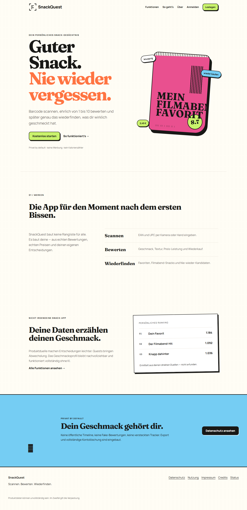

# SnackQuest

SnackQuest ist eine echte, private Snack-Bibliothek unter dem produktiven Pfad [julian-neumann.org/snackquest](https://julian-neumann.org/snackquest). Barcodes werden per Kamera oder manuell erfasst, serverseitig über Open Food Facts aufgelöst und anschließend mit persönlichen 1–10-Bewertungen, Tags, Preisen, Kauforten, Fotos, Sammlungen, Duellen und Quests gespeichert.



## Produktprinzipien

- Keine Demo-Konten, Fake-Bewertungen, erfundenen Zahlen oder Testimonials.
- E-Mail-Verifizierung, Passwort-Reset und Google OAuth statt Schein-Login.
- MariaDB mit serverseitiger Eigentümerprüfung für jede private Ressource.
- Native `BarcodeDetector`-Erkennung mit ZXing-Fallback und manuellem EAN/UPC-Fallback.
- Open Food Facts API v3 mit Server-Cache, Rate-Limit und klarer Quellenangabe.
- Installierbare PWA; private Offline-Entwürfe sind pro Konto isoliert und werden beim Logout gelöscht.
- Optionale lokale GPT-OSS-Auswertung nur nach Opt-in und nur mit aggregierten Profildaten.
- Kein öffentlicher Feed. Bereinigte Share-Momentaufnahmen entstehen nur ausdrücklich und sind widerrufbar.

## Stack

PHP 8.3, MariaDB/InnoDB, Vanilla JavaScript, CSS, PWA Service Worker, ZXing for JS und Playwright. Die App läuft passend zur vorhandenen CouchPilot-Infrastruktur als isolierter IONOS-Unterpfad. Sie teilt weder Tabellenpräfix, Cookie-Namen noch Uploadpfade mit CouchPilot.

## Lokal starten

Voraussetzungen: PHP 8.3 mit `pdo_sqlite`, `mbstring`, `curl` und `gd`; Node.js 22+.

```powershell
npm ci
npm run build
npm test
npm run test:e2e
```

Die Tests verwenden ausschließlich eine flüchtige SQLite-Datenbank und den E-Mail-Log-Transport. Die in den Screenshots sichtbaren Einträge sind isolierte Testdaten, keine behaupteten Produktivnutzer.

## Konfiguration

`config/config.example.php` nach `config/config.local.php` kopieren und ausschließlich lokal befüllen. Die lokale Datei, Google-OAuth-JSON, Logs, Uploads und Datenbanken sind ignoriert. `.env.example` dokumentiert die korrespondierenden Deployment-Werte; zur Laufzeit lädt die PHP-App die erzeugte lokale PHP-Konfiguration.

```powershell
php bin/migrate.php
php bin/maintenance.php
```

## Qualität

```powershell
npm run lint
npm run audit:secrets
npm audit --audit-level=high
npm test
npm run test:e2e
```

Die End-to-End-Suite deckt Registrierung, Verifizierung, Login, Onboarding, private Produkte und Uploads, Bewertungen, Bibliothek, Sammlungen, Duelle, Export, Teilen/Widerruf und vollständige Kontolöschung in Desktop- und Mobile-Chromium ab. Details: [Testbericht](docs/TEST_REPORT.md).

## Dokumentation

Startpunkte: [Produktspezifikation](docs/PRODUCT_SPEC.md), [Architektur](docs/ARCHITECTURE.md), [Sicherheit](docs/SECURITY.md), [Deployment](docs/DEPLOYMENT.md), [Betrieb](docs/OPERATIONS_RUNBOOK.md) und [Live-Release](docs/LIVE_RELEASE.md).

## Daten und Lizenzen

Open-Food-Facts-Datenbank unter ODbL/Database Contents License, Produktbilder unter CC BY-SA. ZXing for JS steht unter MIT; Manrope und Fraunces unter SIL OFL. Der SnackQuest-Code steht unter der [MIT-Lizenz](LICENSE).
