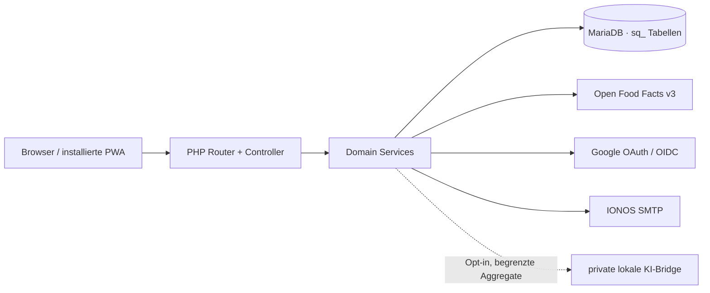

# Architektur

Browser → IONOS Apache/PHP 8.3 → MariaDB. Externe serverseitige Verbindungen bestehen zu Open Food Facts, IONOS SMTP, Google OAuth und – nur nach Opt-in – zur privaten lokalen KI-Bridge. Statische PWA-Dateien liegen im selben `/snackquest`-Pfad.

## Grenzen

- `sq_`-Tabellen, `sqsess`-Cookie, `/snackquest`-Upload- und Logpfade isolieren die App von CouchPilot.
- Controller akzeptieren IDs nie als Eigentumsnachweis; Services filtern auf den angemeldeten Nutzer.
- Open-Food-Facts-Zugriffe sind serverseitig gecacht und ratenlimitiert.
- Uploads sind nicht öffentlich adressierbar und werden nur nach Eigentümerprüfung ausgeliefert.
- Private App-, Auth-, Media- und API-Seiten sind `noindex` und werden nie vom Service Worker gecacht.

## ADR-001: PHP/MariaDB statt Next/Supabase

Status: angenommen. Die ausdrückliche Nutzeranweisung verlangt CouchPilot-Orientierung, MariaDB und den bestehenden IONOS-Unterpfad. Die Architektur nutzt deshalb den bewährten lokalen/produktiven Stack und reduziert zusätzliche Anbieter, DNS-Änderungen und Betriebsflächen.

## ADR-002: Unterpfad statt Subdomain

Status: angenommen. Öffentliche URL ist `julian-neumann.org/snackquest`; OAuth-Redirect, Manifest, Service-Worker-Scope und Rewrite-Regeln sind darauf festgelegt. Es wird kein bestehender DNS-Eintrag verändert.

## ADR-003: Keine RLS

Status: angenommen. MariaDB besitzt hier keine Supabase-RLS-Schicht. Eigentümerisolation wird in jeder serverseitigen SQL-Operation erzwungen und mit Cross-User-Tests abgesichert; Details in [RLS_AND_STORAGE.md](RLS_AND_STORAGE.md).
