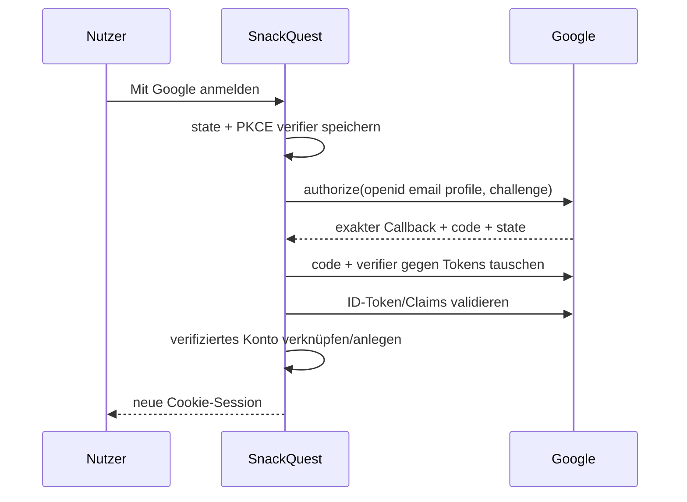

# Authentifizierung und Google OAuth

E-Mail-Konten verwenden `password_hash`, Verifizierungs- und Reset-Tokens werden ausschließlich gehasht gespeichert und laufen ab. Rate Limits schützen Registrierung, Login und Reset. Nach Login wird die Session-ID regeneriert; Cookies sind `HttpOnly`, `Secure` in Produktion und `SameSite=Lax`.

Produktionswerte:

- Origin: `https://julian-neumann.org`
- Redirect: `https://julian-neumann.org/snackquest/auth/callback`
- Zielgruppe: extern
- Scopes: `openid`, `email`, `profile`

Client-Secret und Client-JSON bleiben ausschließlich in ignorierter lokaler bzw. produktiver Konfiguration. Bestehende CouchPilot-Clients werden nicht wiederverwendet oder verändert.
