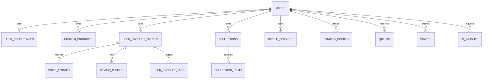

# Datenbank

Produktion: MariaDB, InnoDB, `utf8mb4`, Tabellenpräfix `sq_`, echte Foreign Keys und vorbereitete PDO-Statements. Tests nutzen eine schemagleiche SQLite-Variante.

Migrationen sind additiv und werden über `sq_migrations` verfolgt. `bin/migrate.php` ist idempotent. Löschung eines Nutzers kaskadiert alle privaten Relationen; Uploaddateien werden danach aus dem privaten Storage entfernt. Produktcache ist nicht nutzerbezogen.
