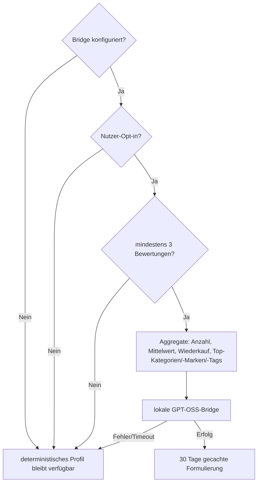

# Lokale KI

Die KI ist optional, standardmäßig aus und für keine Kernfunktion nötig. Produktion verbindet ausschließlich serverseitig mit einer privaten OpenAI-kompatiblen GPT-OSS-Bridge.

Ausgeschlossen sind E-Mail, Anzeigename, freie Notizen, Einzelpreise, Kauforte, Fotos und interne IDs. API-Key und Bridge-Details werden nie an den Browser ausgeliefert oder geloggt. Die Ausgabe darf keine Gesundheitsbehauptungen oder nicht aus den Aggregaten ableitbare Fakten erfinden.
