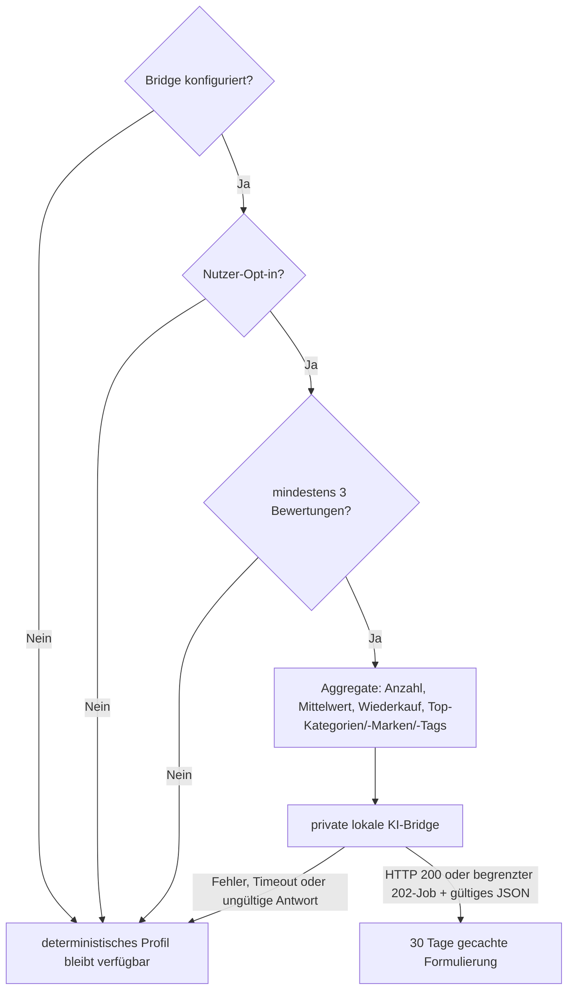

# Lokale KI

Die KI ist optional, standardmäßig aus und für keine Kernfunktion nötig. Produktion verbindet ausschließlich serverseitig mit der privaten OpenAI-kompatiblen KI-Bridge. Der Schlüssel bleibt auf dem Server.

Ausgeschlossen sind E-Mail, Anzeigename, freie Notizen, Einzelpreise, Kauforte, Fotos und interne IDs. Kategorien, Marken und Tags werden vor dem Senden gekürzt und als nicht vertrauenswürdige Daten behandelt. API-Key und Bridge-Details werden nie an den Browser ausgeliefert oder geloggt.

Die Antwort muss einem kleinen JSON-Schema entsprechen und wird auf Länge, HTML, Links und Gesundheitsbehauptungen geprüft. Langsamere Bridge-Jobs werden nur innerhalb des festen Zeitlimits und ausschließlich über die erlaubte, authentifizierte Ergebnis-URL abgeholt. Pro Konto sind vier neue Auswertungen pro Stunde möglich. Nach drei Bridge-Fehlern pausiert der KI-Zugriff fünf Minuten automatisch; das normale Profil bleibt jederzeit verfügbar.
