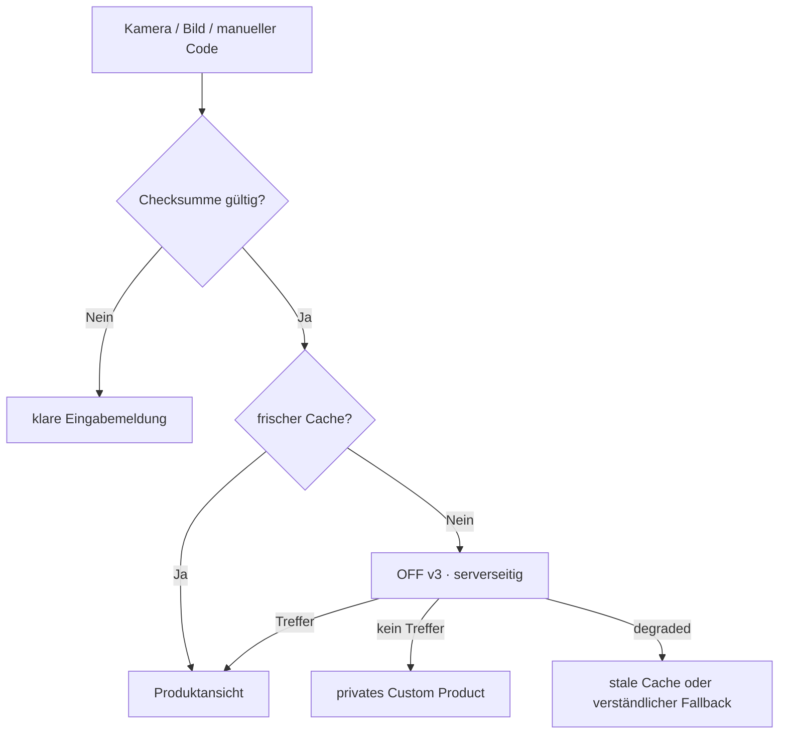

# Open Food Facts

SnackQuest liest Produkte serverseitig aus API v3.6 anhand eines validierten EAN-13, EAN-8 oder UPC-A. Der Response wird auf eine kontrollierte Feldliste normalisiert; fehlende Communitydaten bleiben leer und werden nie erfunden.

Schutz: individueller User-Agent, harte Timeouts, positiver/negativer Cache, konservatives Limit von 13 Produktabfragen pro Minute/IP, keine Suche beim Tippen. Quelle, ODbL/DbCL, CC BY-SA für Bilder und der Hinweis auf möglicherweise unvollständige Daten sind sichtbar.
